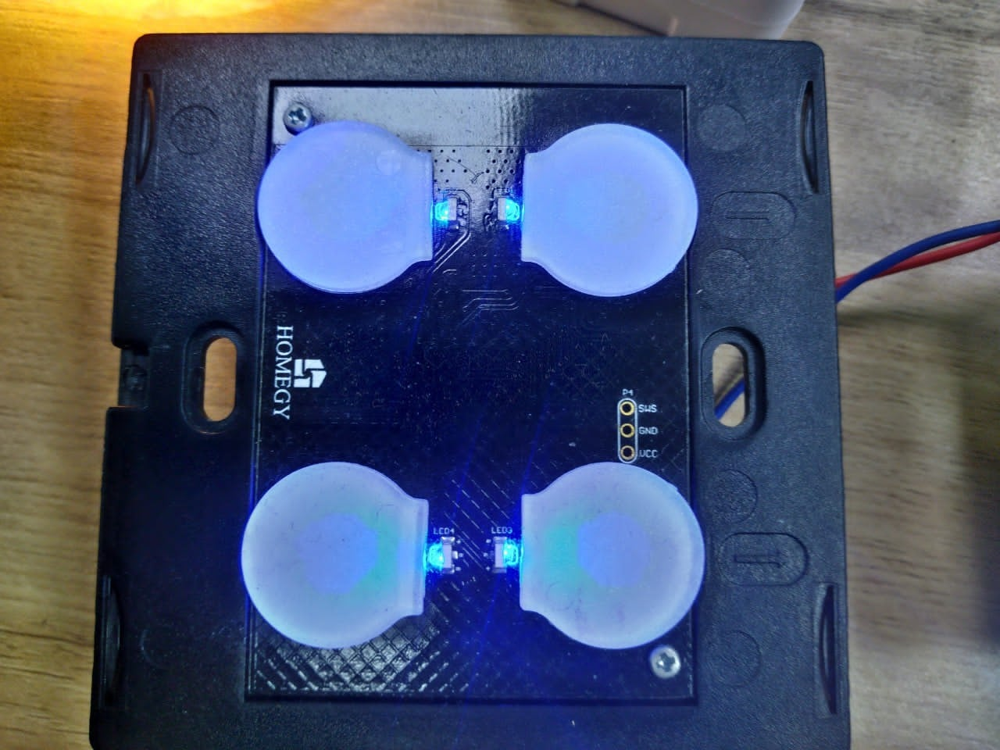

# Homegy Smart Home Project

## 📌 Introduction
**Homegy Smart Home** is a smart home system aiming to replace traditional mechanical switches with **touch switches, smart relays, and IoT sensors**.  
Users can easily control lights, fans, and other appliances via **mobile applications** or **voice assistants** (Google Home, Alexa).

---

## 🚀 Key Features
- ✅ **Capacitive touch switches** (2-gang / 4-gang).  
- ✅ **Remote control over the Internet** via Wi-Fi.  
- ✅ **PIR & light sensor**: automatically turns on lights when motion is detected.  
- ✅ **High-power relays**: directly control AC loads.  
- ✅ **OTA Update**: upgrade firmware remotely.  
- ✅ **Ecosystem integration**: compatible with Google Home, Alexa, and Homegy App.  

---

## 🛠️ Technologies
- **MCU/Module:** ESP8266 / ESP32 (Wi-Fi SoC).  
- **Hardware:** Relays, AC-DC switching power supply, PIR sensors, status LEDs.  
- **Firmware:** C/C++ (ESP-IDF / Arduino Core).  
- **Protocols:** MQTT, HTTP.  
- **Cloud & App:** Homegy server + mobile application.  

---

## 📊 System Architecture

### 🔎 Analysis
The diagram illustrates how **users, devices, Wi-Fi network, and cloud services** interact:

1. **User Layer**  
   - Users can control devices via the **Mobile App** (using Wi-Fi / Internet) or **Voice Assistants** (Google Home, Alexa).  

2. **Smart Devices Layer**  
   - Includes **touch switches, relays, and PIR + light sensors**.  
   - These devices connect to the network using **ESP8266/ESP32 Wi-Fi modules**.  

3. **Network Layer**  
   - The **Wi-Fi network** acts as a communication bridge between devices and the cloud.  
   - Data and control signals are exchanged in real-time.  

4. **Cloud Layer**  
   - The **API & MQTT Broker** manage device communication, command handling, and data sync.  
   - A **Database** stores status, logs, and configuration.  
   - Cloud services ensure scalability, remote control, and third-party integration (Google Home, Alexa).  

➡️ This layered design enables **real-time control, automation, and seamless integration** with modern smart home ecosystems.  

---

## 📚 Use Case Example

### Scenario: Auto Light with PIR Sensor
1. **Detection**: PIR sensor detects motion in a room.  
2. **Signal**: The sensor sends a trigger signal via Wi-Fi to the cloud.  
3. **Decision**: Cloud service processes the event and checks the light condition.  
4. **Action**: If the room is dark, the **relay module** is activated to turn on the light.  
5. **Notification**: User receives a push notification on the mobile app.  

✅ Result: Lights automatically turn on when motion is detected, improving comfort and saving energy.  

---

## 📸 Product Images

### 2-Gang Touch Switch

### AC-DC Power Module

### Relay Control Board

### Central Sensor (PIR + Light)

### 4-Gang Touch Switch

---
